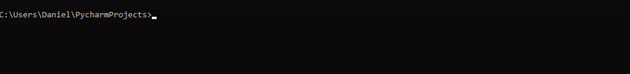
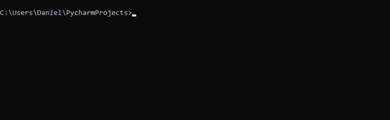

# Recommender-System

The developed recommender system is part of our master thesis ([download](static//thesis/thesis.pdf)). Based on the
challenge that Data Science is an highly interdisciplinary field of research. This area combines complex methods of 
statistics, mathematics, computer science and machine learning. Nevertheless, the handling of domain-specific data
requires comprehensive domain knowledge. The developed application tries to close the gap between data scientist and 
domain experts. On the one hand the access to the domain specific topic is simplified for the data scientist and on
the other hand the domain expert has an first point of reference for a more comprehensive discussion with the data scientist.


## Documentation
A detailed description about all the classes, functions, interfaces and the project structure you'll find in the 
<a href="http://wwwpub.zih.tu-dresden.de/~s4945549/documentation/index.html">documentation</a> of the project

You can also open the documentation by  downloading the project and navigate yourself to ``static/documentation/index.html`` 
and open the file in your browser. Otherwise you can also use the link in the footer of the application.


### Notes an pre Requirements

#### Pre Requirements
- Docker version: 18.09.2
- Python version: 3.6.7
#### Notes
- The docker container as well as the requirements.txt are build on TensorFlow 1.13.0 without(!) GPU support
- If you want GPU support you need to build your own docker image and change the requirements.txt
- All squared brackets [] in the following code are placeholder and are not part of the command!

## Installation

Basically,  you have to ways to install the recommendation system: 

__Recommended Approach:__
1. Basically you can just use the .sh or .bat files of the project to install the software. 
(_We don't guarantee that these will work on every platform!_)

__Other Approaches:__ 
2. You can use the docker image (<a href = "">rs_export.tar</a>) to load the image and run the container.
3. You can also set up a python environment and run the program via _app.py_ (_Only recommended for development_)

## Installation with the bash files
Depending on which operating system you are working you only need to run those files in your terminal. 

__Windows__:

__Linux/Mac__:

## Using the Docker Container
The docker consists of all necessary files, libraries and dependencies to start the software - so you don't need to install them. 
Before you start, make sure that you have installed docker (https://docs.docker.com/docker-for-windows/install/). 

1. Follow the steps as described here: <a href="https://docs.docker.com/docker-for-windows/install/">docker installation</a> to install Docker. 
2. Open the terminal and load the docker image: ```docker load --input [PATH TO rs_export.tar] ```
3. Create a docker container with the name "rs" and run it on port 80: ```docker run --name rs  -p 80:80 rs```

### Installation via pip (or conda)
If you don't prefer to use a docker container, you can also install the software to your local python environment. 
We recommend to create a new environment via venv or conda. All required packages are listed in the requirements.txt file. 
__Please make sure that you use at least Python 3.6.7__

1. First update pip: ``pip install --upgrade pip``
2. Install the packages via pip: `` pip install -r [PATH TO requirements.txt]`` 
3. After the installation completed run the following command in your python environment to install the pke package: 
    ``pip install git+https://github.com/boudinfl/pke.git``
4. Download all necessary nltk packages: 
    * First type in your terminal (with you corresponding python environment): ``python``
    * Type ``import nltk``
    * Type ``nltk.download("all")``
    * Exit python with: ``exit()``
5. Now you can run the app in you python environment by using following command: ``python [PATH TO app.py]``


#### Some other use full commands
1. Stop a running container: ```docker stop [NAME OF CONTAINER]``` 
2. Start the docker container again: ```docker start rs```
3. List all containers ``docker ps -a``
4. List all images ``docker images``
5. Delete a container ``docker rm [CONTAINER NAME]``
6. Delete a docker image ``docker image rm [IMAGE NAME]``


## Start the application
In default mode the application runs at localhost with the port 80. After installation you should enter in your 
browser ``localhost:80`` and the application should start. Do guarantee the full functionality you should use Google Chrome. 


## Building a Docker Image
The implemented software may be used for later research projects. If you want to build your own docker image you can use
the docker file attached to the code but you can also install the packages directly to you local python distribution if you prefer.
But make sure you copy the docker files outside of the Recommender-System project to build the container. 

The directory structure need to be as followed: 

```
- Dockerfile
- .dockerignore
- Recommender-System
    - data
    - models
    - ...
```

1. Open a terminal and navigate yourself to the directory where you copied the Dockerfile: ``cd [PATH TO Dockerfile]``  
2. Build the image (__This may take a while!__): ```docker build ./ -t rs```  
  
3. Check if docker installed the container: ``docker ps -a`` (If not execute step 5)  
  
4. Now you can start and run/stop the docker as usual  
  
5. Build the container and test it (if necessary): ``docker run --name rs  -p 80:80 rs``  
