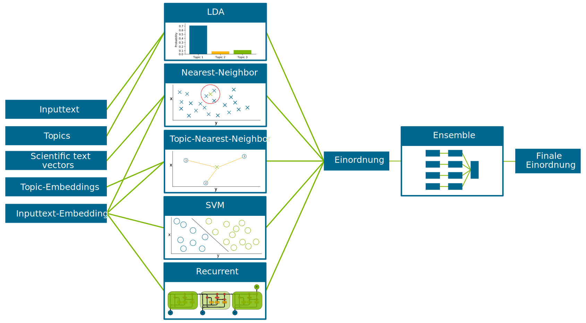

General Information
===================

The general goal of the project is to recommend data mining method groups automatically by analyzing textual problem descriptions. 
Therefore, the training of models was performed on scientific papers and their abstracts. 

Mainly there are three steps that we followed by constructing the recommender system (See figure below)

.. image:: _static/process.png
	:scale: 30 %
	:alt: alternate text

- In the preprocessing the textual data is cleaned
- The building of the knowledge base contains actions to generate knowledge based on the preprocessed data and to save this in some structured way. Thus, the knowledge base contains the following information: 

	- Word propability distribution over topics (Topic Modeling - LDA)
	- Topics in terms of extracted keywords
	- Topic-Embeddings based on the extracted keywords
	- Vector space of data science area (FastText & DAN)
	- Vector representations of scientific publications and sub-sentences. 

- The usage of the knowledge base is then done by different classifiers that were joined by weighted averaging in ensemble learning. 

Usage of Knowlegde base is performed as follows: 

